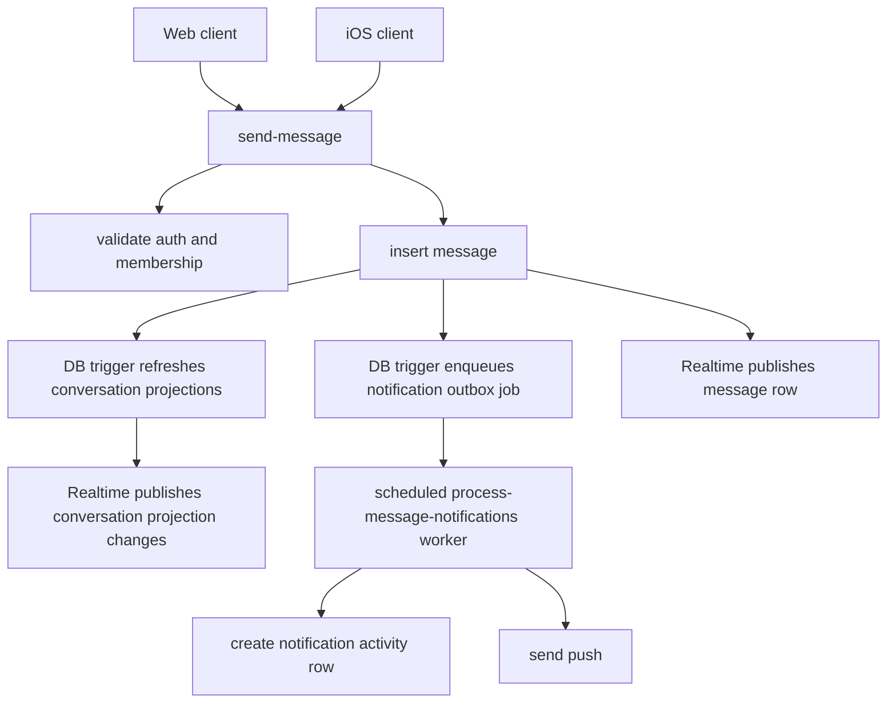

# Messaging Architecture Implementation Plan

Status: Proposed
Date: 2026-03-10
Owner: Engineering
Depends on: [Messaging_Architecture_Review_2026-03-10.md](/tmp/agentflo-messaging/agentassist-build/docs/Messaging_Architecture_Review_2026-03-10.md)

## 1. Goal

Consolidate messaging into one backend-owned message lifecycle that works the same way on web and iOS.

This plan is not a feature expansion plan. It is a reliability and architecture consolidation plan.

## 2. Decisions

### 2.1 Source of Truth

Keep Supabase/Postgres as the messaging system of record.

Do not introduce Firebase Realtime as a second live data plane.

### 2.2 Authoritative Message Command

All clients will use one backend command:

- `send-message`

We will keep the existing function name to reduce migration churn, but change its role:

1. it becomes the only supported message creation path
2. it owns authorization, idempotency, persistence, projection updates, and outbox enqueue
3. direct client inserts into `public.messages` become unsupported

### 2.3 Notification Processing

`process-message-notifications` becomes the only notification processor.

Clients will not call it directly after migration.

### 2.4 Live Delivery

Supabase Realtime remains the primary live transport.

Polling remains only as a recovery strategy:

1. on app foreground
2. on reconnect
3. on channel failure

Steady-state 2-second and 3-second polling will be removed.

## 3. Target End State



## 4. Scope

## In Scope

1. unify the send path for web and iOS
2. remove direct client message inserts
3. make notification processing backend-owned
4. harden realtime subscription handling
5. reduce polling to recovery-only behavior
6. add observability for message and notification pipelines

## Out of Scope

1. attachments
2. reactions
3. replies
4. search
5. group chat
6. UI redesign

## 5. API Contracts

## 5.1 `send-message`

Path:

- `supabase/functions/v1/send-message`

Request:

```json
{
  "body": "Hello",
  "conversationId": "uuid",
  "taskId": null,
  "clientMessageId": "uuid",
  "messageType": "text",
  "metadata": {}
}
```

Rules:

1. `body` is required for `text`
2. exactly one of `conversationId` or `taskId` is required
3. `clientMessageId` is required for client sends
4. `messageType` allowed values:
   - `text`
   - `image`
   - `file`
   - `system`

Response:

```json
{
  "message": {
    "id": "uuid",
    "conversation_id": "uuid",
    "task_id": "uuid-or-null",
    "sender_id": "uuid",
    "body": "Hello",
    "client_message_id": "uuid",
    "message_type": "text",
    "metadata": {},
    "created_at": "timestamp"
  },
  "notification_job_id": "uuid-or-null"
}
```

Backend guarantees:

1. caller is authenticated
2. caller is a valid participant
3. `clientMessageId` is idempotent per `(conversation_id, sender_id)`
4. message row is inserted once
5. participant rows exist
6. conversation summary is refreshed
7. notification outbox job is enqueued if applicable

Non-guarantees:

1. push is not guaranteed to be complete before the response returns
2. notification activity row may be created asynchronously by the worker

## 5.2 `process-message-notifications`

Path:

- `supabase/functions/v1/process-message-notifications`

Invocation model:

1. scheduled/internal only
2. not user-invoked from web or iOS

Request:

```json
{
  "limit": 100
}
```

Optional targeted request for admin/debug:

```json
{
  "messageId": "uuid"
}
```

Worker guarantees:

1. claims only `pending` or retryable jobs
2. creates notification activity row if needed
3. sends push to all active recipient tokens
4. marks job `sent`, `skipped`, or `failed`
5. updates `notifications.push_sent_at` when push succeeds

## 5.3 Conversation Read APIs

Keep:

1. `get_conversation_list_v2`
2. `get_messages_page_v2`
3. `mark_conversation_read_v2`

No contract redesign required in this phase.

The main change is ownership:

1. clients stop owning conversation summary mutation
2. server projection becomes authoritative

## 6. Schema Changes

## 6.1 Keep Existing Tables

Continue using:

1. `messages`
2. `conversations`
3. `conversation_participants`
4. `notifications`
5. `message_notification_jobs`

## 6.2 Required Migration Changes

### Migration A: Outbox Job Ownership Cleanup

Goal:

1. ensure the trigger only enqueues jobs
2. ensure the worker is the only creator of message notification activity rows

Status:

This is partially in place already and should be preserved.

### Migration B: Enforce Canonical Send Path

Add guardrails so direct client inserts are no longer supported.

Recommended options:

1. remove `messages` insert policy for authenticated users
2. replace with backend-only insert via service role inside `send-message`

Recommended choice:

- remove direct authenticated insert policy once both clients are migrated

Reason:

1. direct insert makes it impossible to guarantee side effects
2. idempotency and authorization should live in one place

### Migration C: Job Claim Semantics

Tighten `message_notification_jobs` processing semantics:

1. claim only `pending` and `failed`
2. do not allow `processing` to be reclaimed until timeout threshold
3. add `locked_by`
4. add `next_attempt_at`
5. add `failure_count`

### Migration D: Projection Audit Columns

Add audit fields where helpful:

1. `conversations.last_message_id`
2. `conversations.last_message_at`
3. `conversations.last_message_preview`
4. `conversation_participants.last_read_message_id`
5. `conversation_participants.last_read_at`

Most of these already exist; this phase is about making them operationally authoritative.

## 7. Implementation Phases

## Phase 1: Backend Consolidation

Goal:

Make `send-message` the only supported write path.

Tasks:

1. finish hardening `send-message` so it always:
   - authenticates caller
   - resolves canonical conversation
   - enforces membership
   - applies idempotency
   - inserts message
   - ensures participant rows
   - relies on DB trigger for job enqueue
2. remove inline push dispatch from `send-message`
3. return `notification_job_id` if available
4. stop web and iOS from writing directly to `messages`

Acceptance criteria:

1. web send works through `send-message`
2. iOS send works through `send-message`
3. one user action creates one persisted message
4. one persisted message creates at most one notification job

## Phase 2: Notification Pipeline Ownership

Goal:

Make the outbox worker the only notification processor.

Tasks:

1. remove client-triggered `/api/messages/notify` from the critical path
2. make `process-message-notifications` scheduled/internal
3. add deterministic job claiming
4. add retry policy and failure backoff
5. add stale `processing` recovery

Acceptance criteria:

1. clients do not call `process-message-notifications`
2. fresh messages move from `pending` to `sent` or `skipped` without client involvement
3. push send succeeds for valid tokens
4. notification activity rows are created exactly once

## Phase 3: Projection-Driven Clients

Goal:

Stop having clients own inbox projection state.

Tasks:

1. remove local mutation of `last_message_*`, `sort_at`, and `unread_count` as durable state
2. keep optimistic thread append only inside the active thread
3. reconcile conversation list from `get_conversation_list_v2`
4. refetch list on message send success until stable realtime behavior is proven

Acceptance criteria:

1. inbox ordering matches server projection
2. unread counts clear correctly across devices
3. thread state and inbox state converge without manual refresh

## Phase 4: Realtime Hardening

Goal:

Make Realtime observable and trustworthy enough to remove steady-state polling.

Tasks:

1. log channel subscribe state transitions
2. log reconnects, timeouts, and closes
3. add app-level diagnostics toggle for web and iOS
4. replace steady-state polling with:
   - foreground sync
   - reconnect sync
   - channel-error sync
5. remove 2-second and 3-second background polling loops

Acceptance criteria:

1. message thread updates appear live without steady-state polling
2. inbox row updates appear live without steady-state polling
3. channel failures are visible in telemetry

## Phase 5: Cleanup

Goal:

Remove deprecated pathways.

Tasks:

1. delete direct client insert code
2. delete unused `/api/messages/send` fallback logic if no longer needed
3. delete `/api/messages/notify`
4. remove obsolete notification dispatch branches
5. remove old tests that validate deprecated paths

Acceptance criteria:

1. there is exactly one send path in production
2. there is exactly one notification processing path in production

## 8. Client Work Breakdown

## 8.1 Web

Tasks:

1. call `send-message` only
2. stop direct `messages` inserts
3. keep optimistic local message row with `clientMessageId`
4. on success:
   - replace optimistic row with persisted row
5. on failure:
   - mark optimistic row failed
6. remove notification follow-up call
7. reduce polling after realtime hardening

Files likely touched:

1. [/tmp/agentflo-messaging/web/src/services/message-service.ts](/tmp/agentflo-messaging/web/src/services/message-service.ts)
2. [/tmp/agentflo-messaging/web/src/app/(app)/messages/page.tsx](/tmp/agentflo-messaging/web/src/app/(app)/messages/page.tsx)
3. [/tmp/agentflo-messaging/web/src/app/api/messages/send/route.ts](/tmp/agentflo-messaging/web/src/app/api/messages/send/route.ts)
4. [/tmp/agentflo-messaging/web/src/app/api/messages/notify/route.ts](/tmp/agentflo-messaging/web/src/app/api/messages/notify/route.ts)

## 8.2 iOS

Tasks:

1. call `send-message` only
2. stop direct `messages` inserts
3. stop direct notification worker invocation
4. use optimistic local send state in view model if needed
5. keep fallback refresh only until realtime is stable

Files likely touched:

1. [/tmp/agentflo-messaging/ios/AgentFlo/Services/MessageService.swift](/tmp/agentflo-messaging/ios/AgentFlo/Services/MessageService.swift)
2. [/tmp/agentflo-messaging/ios/AgentFlo/Views/Messaging/MessagingView.swift](/tmp/agentflo-messaging/ios/AgentFlo/Views/Messaging/MessagingView.swift)
3. [/tmp/agentflo-messaging/ios/AgentFlo/Views/Messaging/ConversationsListView.swift](/tmp/agentflo-messaging/ios/AgentFlo/Views/Messaging/ConversationsListView.swift)

## 9. Testing Plan

## 9.1 Backend Integration Tests

Required cases:

1. authorized user can send into direct conversation
2. unauthorized user cannot send
3. task send resolves canonical task conversation
4. duplicate `clientMessageId` returns existing row
5. message insert enqueues one notification job
6. worker claims job once
7. worker creates one notification row
8. worker marks push success/failure correctly

## 9.2 Web E2E Tests

Required cases:

1. send message from active thread
2. optimistic row becomes persisted row
3. second browser receives live message
4. inbox row updates
5. unread clears when opening thread
6. reconnect recovers state

Recommended tool:

- Playwright

## 9.3 iOS Tests

Required cases:

1. send message from task thread
2. send message from direct thread
3. second device receives live update
4. inbox unread clears
5. push deep-link opens correct conversation

## 10. Telemetry Plan

Add structured logs and counters for:

1. `message_send_requested`
2. `message_send_persisted`
3. `message_send_idempotent_hit`
4. `notification_job_enqueued`
5. `notification_job_claimed`
6. `notification_job_sent`
7. `notification_job_failed`
8. `push_token_missing`
9. `realtime_channel_subscribed`
10. `realtime_channel_error`
11. `realtime_channel_timeout`
12. `realtime_channel_closed`

Minimum fields:

1. `message_id`
2. `conversation_id`
3. `sender_id`
4. `recipient_id`
5. `platform`
6. `client_message_id`
7. `job_id`

## 11. Rollout Plan

### Step 1

Implement and deploy hardened `send-message`.

### Step 2

Move web to `send-message` only.

### Step 3

Move iOS to `send-message` only and ship TestFlight.

### Step 4

Move notification processing to scheduled/internal worker only.

### Step 5

Disable direct client inserts to `messages`.

### Step 6

Remove steady-state polling once live delivery is proven.

## 12. Rollback Strategy

Rollback is application-level, not destructive schema rollback.

If a phase fails:

1. redeploy the prior client
2. redeploy the prior function version
3. leave additive schema in place

Do not use destructive DB rollback for messaging tables in production.

## 13. Approval Questions

These are the decisions that should be explicitly approved before implementation:

1. Should `send-message` remain the canonical command name, or do you want a new `create-message` function name?
2. Are you comfortable removing direct client inserts into `messages` entirely?
3. Do you want notification activity creation to move fully into the worker, with no client-triggered dispatch left?
4. Do you want us to treat steady-state polling as temporary technical debt and remove it once realtime is proven?

## 14. Recommended Order of Execution

1. Phase 1: backend consolidation
2. Phase 2: notification pipeline ownership
3. Phase 3: projection-driven clients
4. Phase 4: realtime hardening
5. Phase 5: cleanup

This is the order that reduces risk fastest while keeping the system usable during migration.
