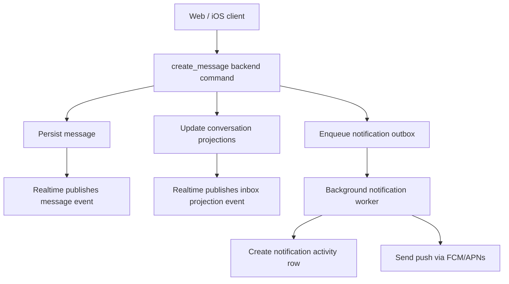

# Messaging Architecture Review

Status: Review draft
Date: 2026-03-10
Owner: Engineering
Scope: Web, iOS, Supabase messaging backend, push pipeline, live-update model

## 1. Executive Summary

The current messaging system is not failing because of one isolated bug. It is failing because the system does not have a single authoritative owner for message creation, message side effects, conversation projections, or live delivery.

The same message lifecycle is currently split across:

1. direct client database inserts
2. edge-function message creation
3. database triggers
4. client-triggered notification dispatch
5. worker-triggered notification dispatch
6. realtime subscriptions
7. polling fallbacks

That split ownership has created three structural problems:

1. The write path is inconsistent across platforms.
2. Push and notification activity are not guaranteed to happen when a message is persisted.
3. Live updates are treated as a best-effort enhancement instead of a first-class delivery contract.

The correct next step is not more isolated patching. The correct next step is to simplify the architecture around a single backend-owned message command and a single backend-owned side-effect pipeline.

## 2. Current System

### 2.1 Current Write Paths

Web currently writes messages directly into `public.messages` in [message-service.ts](/tmp/agentflo-messaging/web/src/services/message-service.ts:200), then separately attempts notification dispatch in [message-service.ts](/tmp/agentflo-messaging/web/src/services/message-service.ts:209).

iOS currently writes messages directly into `public.messages` in [MessageService.swift](/tmp/agentflo-messaging/ios/AgentFlo/Services/MessageService.swift:121), then separately attempts notification dispatch in [MessageService.swift](/tmp/agentflo-messaging/ios/AgentFlo/Services/MessageService.swift:136).

There is also a parallel edge-function write path in [send-message/index.ts](/tmp/agentflo-messaging/agentassist-build/supabase/functions/send-message/index.ts:138), which performs its own authorization, conversation resolution, insert, and notification dispatch.

### 2.2 Current Notification Paths

The database trigger only enqueues a job in `message_notification_jobs` in [20260311000001_message_notifications_dispatch_ownership.sql](/tmp/agentflo-messaging/agentassist-build/supabase/migrations/20260311000001_message_notifications_dispatch_ownership.sql:45).

Web can process that job through a Next.js route in [route.ts](/tmp/agentflo-messaging/web/src/app/api/messages/notify/route.ts:64).

iOS can process that job by invoking `process-message-notifications` in [MessageService.swift](/tmp/agentflo-messaging/ios/AgentFlo/Services/MessageService.swift:67).

There is also a standalone worker implementation in [process-message-notifications/index.ts](/tmp/agentflo-messaging/agentassist-build/supabase/functions/process-message-notifications/index.ts:107).

The edge send function can bypass that and dispatch directly via `send-notification` in [send-message/index.ts](/tmp/agentflo-messaging/agentassist-build/supabase/functions/send-message/index.ts:59).

### 2.3 Current Live Update Paths

Web thread live updates subscribe directly to `public.messages` in [message-service.ts](/tmp/agentflo-messaging/web/src/services/message-service.ts:298) and the thread view in [page.tsx](/tmp/agentflo-messaging/web/src/app/(app)/messages/page.tsx:373). The inbox separately subscribes to `conversation_participants` in [message-service.ts](/tmp/agentflo-messaging/web/src/services/message-service.ts:281).

iOS thread live updates subscribe directly to `public.messages` in [MessageService.swift](/tmp/agentflo-messaging/ios/AgentFlo/Services/MessageService.swift:226).

Both platforms now also poll aggressively:

1. web inbox every 3 seconds in [page.tsx](/tmp/agentflo-messaging/web/src/app/(app)/messages/page.tsx:138)
2. web thread every 2 seconds in [page.tsx](/tmp/agentflo-messaging/web/src/app/(app)/messages/page.tsx:336)
3. web notifications every 3 seconds in [page.tsx](/tmp/agentflo-messaging/web/src/app/(app)/notifications/page.tsx:33)
4. iOS thread every 2 seconds in [MessagingView.swift](/tmp/agentflo-messaging/ios/AgentFlo/Views/Messaging/MessagingView.swift:296)
5. iOS inbox every 3 seconds in [ConversationsListView.swift](/tmp/agentflo-messaging/ios/AgentFlo/Views/Messaging/ConversationsListView.swift:79)

## 3. Architectural Findings

### 3.1 There Is No Single Message Command

This is the core defect.

The system does not currently have a single authoritative `create_message` operation. Instead, it has multiple paths that are logically trying to perform the same command:

1. client insert
2. edge-function insert
3. trigger-enqueued follow-up
4. client/server notification dispatch follow-up

Consequences:

1. web and iOS do not behave the same under auth, retries, or deploy mismatch
2. side effects can be skipped even when persistence succeeds
3. authorization and idempotency are duplicated across layers

### 3.2 Message Side Effects Are Not Owned by the Backend

Persisting a message should atomically guarantee that the backend owns all downstream work:

1. conversation summary refresh
2. unread/read projection update
3. notification job enqueue
4. notification send attempt
5. delivery audit trail

Today, only part of that is backend-owned. Push dispatch still depends on a separate client-initiated hop after persistence on both web and iOS.

That is not a production-grade messaging model.

### 3.3 Live Delivery Contract Is Undefined

The system uses Supabase Realtime, but the architecture does not define what "live" means operationally.

Questions the system currently cannot answer with one canonical contract:

1. Which table change is the source of truth for thread updates?
2. Which event is the source of truth for inbox row updates?
3. Which event clears unread count?
4. What is the recovery behavior when realtime fails?

Instead, the app currently mixes:

1. raw `messages` subscriptions
2. `conversation_participants` subscriptions
3. local optimistic cache patching
4. background polling
5. server refetch on non-subscribed channel states

That is a fallback strategy, not an architecture.

### 3.4 The Read Model Is Too Client-Managed

Web mutates local conversation previews optimistically in [page.tsx](/tmp/agentflo-messaging/web/src/app/(app)/messages/page.tsx:383) and [page.tsx](/tmp/agentflo-messaging/web/src/app/(app)/messages/page.tsx:453). That means inbox summary behavior depends on local mutation order and network timing instead of a canonical server projection.

The server has a read model available through `get_conversation_list_v2`, but the client still behaves as if it owns the projection between polls and refetches.

That is why unread counts and thread list rows drift.

### 3.5 Notification Processing Has Too Many Valid Callers

Notification processing can currently be initiated by:

1. web app route
2. iOS client
3. edge send function
4. worker function

Even if all of those are authorized, that is the wrong architecture. A message-notification pipeline should have one producer contract and one processor contract.

### 3.6 Observability Is Insufficient

For a distributed messaging pipeline, the system should be able to answer:

1. Was the message persisted?
2. Was the message projected to the inbox?
3. Was the notification job created?
4. Was it claimed?
5. Was push attempted?
6. Did realtime publish?
7. Did the client subscribe successfully?
8. Did the client receive the event?

Right now those answers are fragmented across ad hoc logs and manual DB inspection.

## 4. Root Cause Summary

The system is over-distributed for its current maturity.

Too many components are participating in the same message lifecycle:

1. client UI
2. client persistence
3. server proxies
4. edge functions
5. SQL triggers
6. async workers
7. push dispatch
8. realtime transport
9. polling fallback

Each component can succeed while another component fails, and there is no single orchestration layer that defines success for the overall command.

## 5. Target Architecture

## 5.1 Core Principle

There should be exactly one backend-owned `create_message` command.

All clients should call that same command.

That command should be responsible for:

1. authorization
2. conversation resolution
3. idempotency
4. message persistence
5. projection updates
6. outbox enqueue

Clients should not write directly to `public.messages`.

## 5.2 Target Message Flow

This is the critical change:

1. persistence and side effects are initiated from one backend command
2. push dispatch is worker-owned
3. clients observe results; they do not orchestrate them

## 5.3 Proposed Backend Shape

### Command Layer

Introduce one message creation API:

1. Edge function `create-message`
2. or security-definer RPC `create_message_v1`

Recommendation: use an edge function.

Reason:

1. conversation resolution and validation are already application logic heavy
2. idempotency and auth errors are easier to reason about in one request handler
3. it gives a clean shared contract for web and iOS

### Database Layer

The database should continue to own:

1. trigger-based conversation summary refresh
2. participant state maintenance
3. outbox enqueue

The database should stop depending on clients to finish the pipeline.

### Worker Layer

The outbox worker should be the only process that:

1. creates `new_message` notification activity rows
2. sends push notifications
3. marks outbox jobs `sent`, `skipped`, or `failed`

The worker should be invoked by a real background mechanism, not by the client.

Recommended options:

1. Supabase scheduled worker that continuously drains pending jobs
2. database-triggered HTTP call to a trusted internal worker endpoint
3. external queue/worker if scale requires it later

The current client-triggered `/api/messages/notify` route should be removed from the long-term design.

## 5.4 Target Read Model

The system should expose two projection contracts:

1. `message_thread_projection`
   Source for thread rendering and pagination

2. `conversation_list_projection`
   Source for inbox rows, unread counts, last message preview, sort order, pin/archive state

Clients should treat these projections as authoritative.

Clients may optimistically render local state, but they should reconcile against server projections, not maintain their own durable projection logic.

## 5.5 Target Live Delivery Model

Use Realtime as the primary transport, but narrow what it carries:

1. `messages` inserts for thread append
2. `conversation_participants` and `conversations` changes for inbox projection updates
3. `notifications` inserts/updates for notification center

The important shift is not the transport. It is the ownership model.

Polling should remain only as a recovery strategy:

1. poll once on reconnect
2. poll on channel failure
3. poll on foreground resume

Do not keep 2-second and 3-second steady-state polling as a permanent design.

## 5.6 Push Delivery Model

Push should be outbox-driven.

Required guarantees:

1. one persisted message produces at most one active notification job per recipient
2. a worker can retry safely
3. `notifications` activity rows and push attempts are correlated by job id
4. stale push tokens are deactivated by the worker

## 6. Recommended Future State by Layer

### Client Responsibilities

Clients should:

1. call `create-message`
2. render optimistic local draft state
3. subscribe to thread and inbox projections
4. reconcile with backend state
5. never own push dispatch
6. never own durable unread counts

### Backend Responsibilities

Backend should:

1. own message command semantics
2. own idempotency
3. own authorization
4. own side-effect enqueue
5. own notification processing
6. own retry semantics

### Database Responsibilities

Database should:

1. keep canonical message data
2. maintain projection tables/columns
3. enforce RLS
4. enqueue outbox rows

## 7. Migration Plan

### Phase 1: Architecture Consolidation

1. Stop direct client writes to `public.messages`.
2. Move both web and iOS to one `create-message` backend API.
3. Make that API always enqueue side effects server-side.
4. Remove client-triggered notification dispatch from the critical path.

### Phase 2: Backend-Owned Outbox

1. Make `process-message-notifications` the only notification processor.
2. Trigger it from backend scheduling, not clients.
3. Add deterministic retry and claim semantics.
4. Add dead-letter visibility for repeated failures.

### Phase 3: Projection Cleanup

1. Remove client-owned inbox summary patch logic.
2. Make inbox rows purely projection-driven.
3. Keep optimistic local message rendering only inside the active thread.

### Phase 4: Realtime Hardening

1. Add channel state telemetry on both clients.
2. Add reconnect diagnostics.
3. Replace steady-state polling with event-driven recovery polling.

### Phase 5: Feature Expansion

Only after the architecture is stable:

1. attachments
2. replies
3. edit/delete
4. reactions
5. search
6. mute/archive improvements

## 8. Testing Requirements

The current test posture is not sufficient for this system.

Required additions:

### Backend Integration

1. `create-message` authorization
2. idempotency behavior
3. outbox job creation
4. conversation projection updates
5. notification worker claim and retry semantics

### Web End-to-End

1. send message
2. receive live thread update
3. inbox row updates
4. unread clear
5. retry after reconnect

### iOS Integration/UI

1. send message
2. live thread update
3. inbox row update
4. push deep-link handling

## 9. Recommended Decisions

1. Keep Supabase/Postgres as the messaging system of record.
2. Do not add Firebase Realtime as a second live data plane.
3. Introduce exactly one backend `create-message` command.
4. Move push/activity to a backend-owned outbox worker.
5. Treat polling as recovery only, not steady-state transport.

## 10. Immediate Next Steps

1. Approve the architectural decision to remove direct client message inserts.
2. Design the `create-message` API contract shared by web and iOS.
3. Redesign notification processing so clients never trigger it directly.
4. Add operational telemetry for:
   - message create latency
   - outbox enqueue rate
   - job claim success/failure
   - push send success/failure
   - realtime subscription states

## 11. Bottom Line

The current messaging system is repairable, but not by continuing with isolated fixes.

The root issue is ownership:

1. too many writers
2. too many side-effect initiators
3. too much client-owned projection logic
4. no single backend command defining success

The next implementation phase should be an architecture consolidation phase, not a feature phase.
